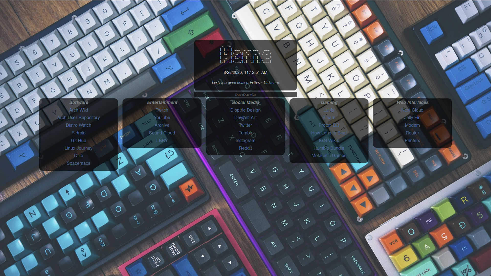
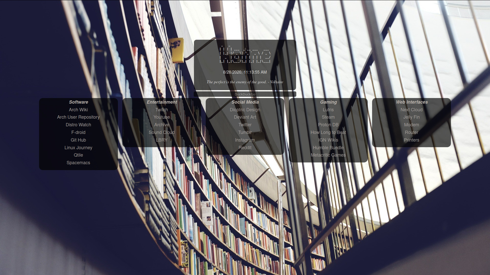

# Min Startpage
A colorful dynamic startpage. For the [qtile-chameleon](https://github.com/DioptricDesign/qtile-chameleon) project.
## More information
For more information about this project check the [blog post.](https://wp.me/p8j8Cr-qe)
## Dependencies 
[pywal](https://github.com/dylanaraps/pywal) for the colors and background image.  
[qtile config](https://github.com/DioptricDesign/qtile-chameleon)

>wallpaper from [Patrik Göthe](https://unsplash.com/photos/xiTFENI0dMY)

>wallpaper from [u/ctzn_voyager](https://www.reddit.com/r/MechanicalKeyboards/comments/4vh8ui/photo_its_getting_crowded_in_here/)

## Install 
` git clone https://github.com/DioptricDesign/min-startpage.git ` 
Move the folder to an appropriate location. To use the page as startpage in [firefox](https://www.mozilla.org/en-US/firefox/) follow this [tutorial](https://www.reddit.com/r/startpages/comments/g3qndt/psa_how_to_set_a_custom_new_tab_page_in_firefox/).
## Special Thanks
Furcd01 this is an extended version of their min-startpage.
